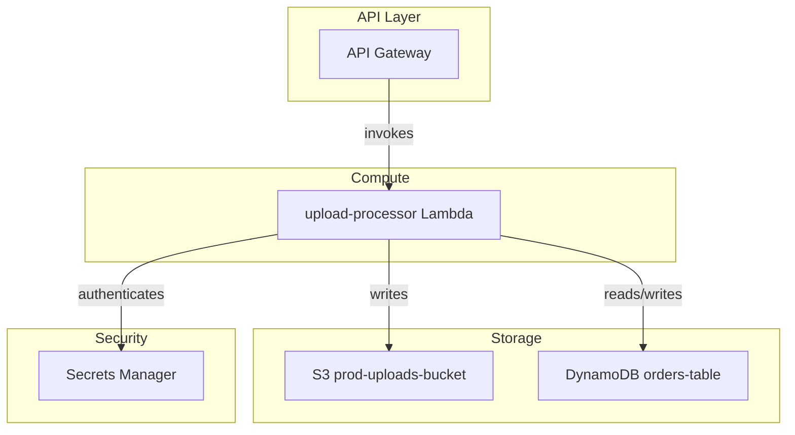

# Output Schemas

## 1. aws-inventory.json

```json
{
  "account_id": "123456789012",
  "region": "us-east-1",
  "discovery_timestamp": "2026-01-01T00:00:00Z",
  "summary": {
    "total_resources": 12,
    "service_count": 6,
    "estimated_complexity": "MEDIUM",
    "estimated_effort_weeks": 4
  },
  "services": {
    "lambda": {
      "count": 2,
      "resources": [
        {
          "arn": "arn:aws:lambda:us-east-1:123456789012:function:upload-processor",
          "name": "upload-processor",
          "runtime": "python3.11",
          "memory_mb": 512,
          "timeout_s": 30,
          "handler": "app.handler",
          "source_path": "source-app/app-code/lambda/upload/",
          "environment_variables": ["BUCKET_NAME", "TABLE_NAME"],
          "layers": [],
          "triggers": [{"source": "API Gateway", "event": "POST /upload"}],
          "vpc_config": {"subnet_ids": [], "security_group_ids": []},
          "dependencies": ["S3BucketUploads", "DynamoDBTable"],
          "tags": {"Environment": "production", "Application": "file-service"},
          "criticality": "HIGH",
          "monthly_cost_usd": 12.50,
          "iam_role": {
            "arn": "arn:aws:iam::123456789012:role/upload-processor-role",
            "permissions": {"s3": ["GetObject", "PutObject"], "dynamodb": ["GetItem", "PutItem"]}
          }
        }
      ]
    },
    "s3": {
      "count": 1,
      "resources": [
        {
          "arn": "arn:aws:s3:::prod-uploads-bucket",
          "name": "prod-uploads-bucket",
          "versioning_enabled": true,
          "public_access_blocked": true,
          "lifecycle_policies": [{"id": "move-to-cold", "transition_days": 90, "storage_class": "GLACIER"}],
          "encryption": {"type": "SSE-S3"},
          "dependencies": [],
          "used_by": ["upload-processor"],
          "criticality": "HIGH",
          "monthly_cost_usd": 8.00
        }
      ]
    },
    "dynamodb": {"count": 1, "resources": []},
    "apigateway": {"count": 1, "resources": []},
    "secretsmanager": {"count": 1, "resources": []}
  },
  "implicit_dependencies": [
    {
      "service": "AWS::SecretsManager::Secret",
      "note": "Referenced in lambda/upload/app.py via boto3 secretsmanager client — not declared in template.yaml"
    }
  ]
}
```

**JSON key naming rules:** snake_case for all keys. Lowercase service names (`lambda`, `rds`, `s3`). Boolean fields: `multi_az`, `encryption_enabled`, `versioning_enabled`.

## 2. architecture-diagram.mmd



Use `graph TB` or `graph TD`. Use `subgraph` for logical groups (API Layer, Compute, Storage, Database, Messaging, Security). Label every edge with the relationship verb.

## 3. dependency-matrix.csv

Column order (always include all columns):

```
Resource A, Type A, Region A, Resource B, Type B, Region B, Relationship, Criticality, Migration Order, Potential Issues, Notes
```

Sample rows:
```csv
Resource A,Type A,Region A,Resource B,Type B,Region B,Relationship,Criticality,Migration Order,Potential Issues,Notes
upload-processor,Lambda,us-east-1,prod-uploads-bucket,S3,us-east-1,writes,High,2,IAM permission mapping,File storage
upload-processor,Lambda,us-east-1,orders-table,DynamoDB,us-east-1,reads/writes,Critical,2,Change Feed vs streams,Order data
api-gateway,API Gateway,us-east-1,upload-processor,Lambda,us-east-1,calls,High,3,Auth mapping,HTTP integration
```

## 4. IAM Documentation (inline in aws-inventory.json)

For every Lambda, ECS task, or EC2 instance, include an `iam_role` block:

```json
{
  "iam_role": {
    "arn": "arn:aws:iam::123456789012:role/my-lambda-role",
    "permissions": {
      "s3": ["GetObject", "PutObject"],
      "dynamodb": ["GetItem", "PutItem", "Query"],
      "secretsmanager": ["GetSecretValue"]
    },
    "external_account_permissions": [],
    "cross_service_permissions": ["sns:Publish"]
  }
}
```

**Secrets rules:** Never capture actual secret values — only names, which resource accesses them, rotation policy, and whether encrypted with a CMK.
